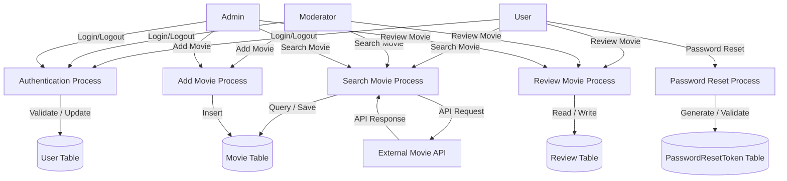

# Movie Project Report

## 1. Project Overview
The Movie Project is a web application built with **Flask** that allows users to manage, search, and review movies. The application supports multiple user roles: `user`, `moderator`, and `admin`, each with different permissions.

## Idea
- **User** – regular user who can search movies, leave reviews, request password reset.
- **Moderator** – can do everything a User can, plus add/delete movies, moderate reviews.
- **Admin** – full control: add/delete movies, manage users (ban/uban, assigning roles), moderate reviews.
  
By default, a new registered user is **User**.
There are some pre-added users with the following credentials: 
| email    | password |
| -------- | ------- |
| adminemail@gmail.com  | admin    |
| moderatoremail@gmail.com | moderator    |
| useremail@gmail.com    | user   |

Login:


Movies with sorting and genre filter:


Reviews with sorting and rating filter:


**DataFlow**




## 2. Technology Stack
- **Backend:** Python 3, Flask, SQLAlchemy
- **Database:** SQLite 
- **API:** REST API endpoints for search and add movie
- **Authentication:** Flask-Login, password hashing using Werkzeug
- **Testing:** `pytest` and `unittest.mock` for unit and integration tests
- **Deployment:** Docker

## 3. Database Structure
**Tables:**
1. `User` – stores users with fields: id, username, email, password hash, role, banned status.
2. `Movie` – stores movies with fields: id, title, genre, year, description, poster.
3. `Review` – stores reviews with fields: id, movie_id, user_id, rating, content.
4. `PasswordResetToken` – stores password reset tokens and status.

## 4. API Endpoints
### Search Movies
`GET /api/search_movies?q=<query>`  
- Returns up to 5 movies matching the search query.
- Handles errors: empty query, too many results, API failure.

### Add Movie
`POST /api/add_movie`  
- Adds a movie to the database using its `imdb_id`.
- Only accessible by moderators or admins.
- Returns JSON with success or error messages.


## 5. Unit and Integration Tests
- **Overall:** 40 tests
- **Unit tests:** Test individual routes, login/logout, registration, role permissions.
- **API tests:** Mock OMDb API calls to ensure search and add workflows behave correctly.
- **Password reset tests:** Verify token generation, usage, and invalid token handling.
- **Movie and review tests:** Verify adding, editing, and deleting reviews with permission checks.

**Testing framework:** `pytest`  
```bash
 python -m pytest --cov=app
```
**Coverage:** Total of 79%, including user authentication, movie management, and API endpoints.


## 6. Docker Deployment
**Dockerfile**:
- Python base image
- Install dependencies from `requirements.txt`
- Copy project files and run Flask app
- Expose port 5000 for the application

**Steps to run:**
1. Build the image:  
   ```bash
   docker build -t movie_project .
   docker run --env-file .env -p 5000:5000 movie_project
   ```
